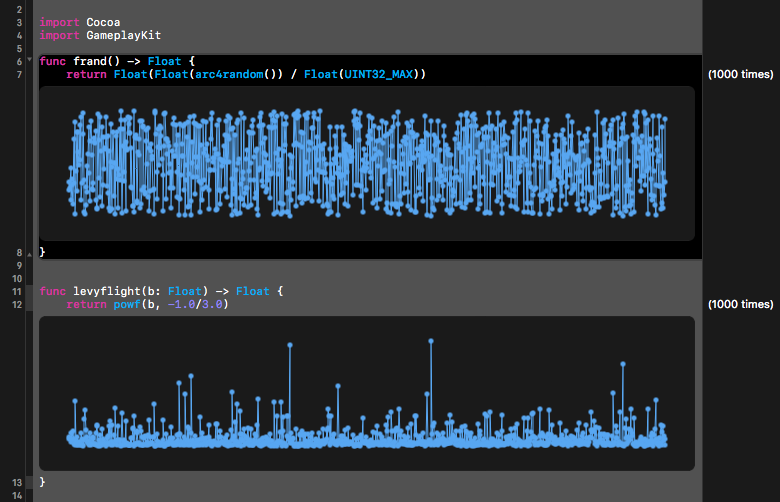
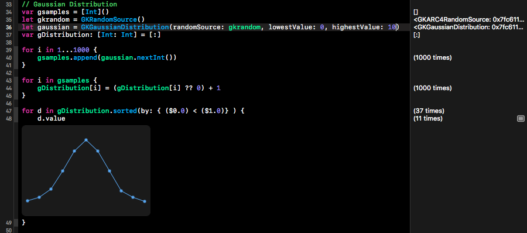
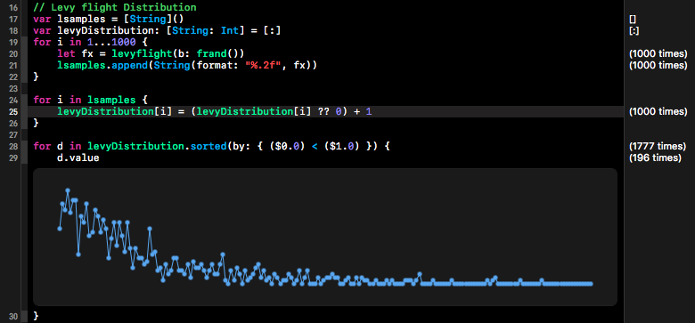

## SwiftEA
### Evolutionary Algorithms in Swift programming language
* Classic EA
* GA
* Nature-inspired Cuckoo Search

Samples:

    Generation 1, fitness 48: ?M7vpaoy"id/6`*:r+4~uBQ{:<[i^8hf;qmFM9-B t=}ppKFO
    Generation 2, fitness 47: NM7vpaoy"id/6`*:r+4~uBQ5:<[P^Yuf;q FM9-B tU}ppKF}
    Generation 3, fitness 46: NM7vpaoy"ii/6`*:r+4~uBQ5:<[P^Yuf;q FMYRR tU}4pKF>
    ...
    Generation 1681, fitness 1: In the beginning we were all fish.)- Ms. Garrison
    Generation 1682, fitness 1: In the beginning we were all fish.)- Ms. Garrison
    Generation 1683, fitness 0: In the beginning we were all fish. - Ms. Garrison
    fittest string: In the beginning we were all fish. - Ms. Garrison

### Distribution of random numbers

Random and Levy distribution

Gaussian distribution

Levyflight distribution

